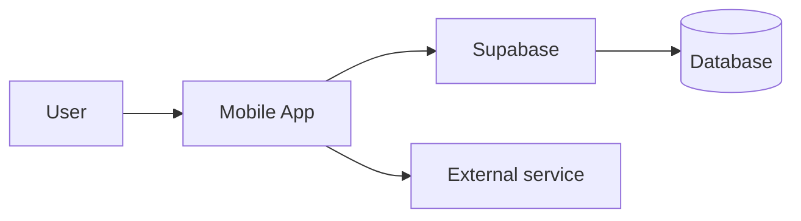

# Kickoff Phases — Deep Walkthrough

This is the full playbook for the 9 kickoff phases. The SKILL.md spine tells
you *what* each phase is; this file is *how* to run each one. Read it when a
kickoff begins, alongside `agents.md` (advisor and overseer briefs) and
`tech-options.md` (the technology menu), and `spec-driven-kickoff.md` (the
Power Inversion framing, the light-vs-full triage, the Simplicity Gate, and the
opt-in Visual Companion).

**Audience reminder.** Assume the person you're guiding is smart but not
technical. They may not know what an MVP, a backlog, a stack, a repository, or
a deployment is. So in every phase: **teach the concept in plain words first,
say why the phase matters, then do the work.** The first time any term appears,
define it in half a sentence (pull from `glossary.md` so wording stays
consistent). Never ask a bare technical question cold.

**Calibrate the hand-holding (ask once, early).** "Non-technical" is the
default, not a permanent assumption. Near the start, read the signal in how the
user talks and ask once, as a menu, how much to explain: **full plain-language
(Recommended) / light (skip the basics, flag the decisions) / minimal (you're
technical — just surface the choices)**. Then honor the answer — at *minimal*,
stop defining MVP, API, CI and treat the user as a peer. The menus, trade-offs,
and recommendations stay exactly the same in every mode; only the tutoring
scales up or down.

**Three rules that hold across all phases:**

- **Explain before you ask.** One or two plain sentences on what a choice means
  and why it matters, *then* the options.
- **Show the whole menu, with honest trade-offs.** For every real decision, the
  responsible advisor agent (from `agents.md`) presents *all* the serious
  options in the mandatory format below — never a truncated two-item list.
- **Recommend, don't dictate.** End each menu with a clear recommendation and
  its one-sentence reason. The user owns the decision; you make it easy. The
  user is non-technical and wants a steer — always give one.
- **Research before you recommend; verify the user's constraints.** For any
  decision with cost, lock-in, or architectural weight, check the current
  official documentation/pricing via web search before recommending — never
  from memory. Write down the user's hard requirements (budget, a spend cap, a
  region, an existing tool, a compliance need) and verify each option against
  them in the docs; fill the `Verified:` line. If you can't confirm a
  constraint is met, say so and don't present the option as if it is. (See
  SKILL.md → *Recommendations are researched and constraint-verified*.)
- **Ask with a clickable menu, not a text question.** Every question in every
  phase is presented as selectable options (recommendation first, labeled
  "(Recommended)"), each with its plain-language description, plus an "Other /
  something else" free-text escape. The user clicks; they shouldn't have to type
  (see SKILL.md → *Always ask with a clickable menu*). The only open-text moment
  is the user's first description of their idea.
- **Every confirm/agree/ready checkpoint is itself a menu.** Even a simple "ready
  to continue?" is offered as options — e.g. "Yes, continue (Recommended) / I
  have a change" — never a bare yes/no typed in prose.
- **Elicit the design before settling it.** For any consequential design or
  scoping decision, propose **2–3 approaches with their trade-offs and a
  recommendation** in plain language — not a single take. Ask **one question at a
  time** where a question needs real thought (don't bury the user in a wall of
  questions). And if the idea spans **multiple independent subsystems**, decompose
  it into sub-projects and take the **first one through the full flow** rather
  than designing everything at once.

**The mandatory option format** (every decision phase uses it):

```
Option: <name>
In plain words: <one sentence — what it actually is, no jargon>
Best for: <the situation where this is the right pick>
Pros: <2–4 short concrete bullets>
Cons / costs: <2–4 short concrete bullets — money, lock-in, learning curve, limits>
```

And close every menu with:

```
Recommendation — <option>, because <one-sentence reason tied to THIS user and product>.
```

Use this light 5-line format by default. Add the heavier `Cost & limits / Verified /
Reversible? / Exit-portability` lines (the full format in SKILL.md) **only** for
choices with real cost or lock-in — host, database, backend, auth — not for every
menu; the founder shouldn't drown in a 7-line card for a project-name pick.

**Overseer gates.** Five kickoff phases are high-stakes and get an independent
**Phase Gate Reviewer** (defined in `agents.md`) before the process moves on:
**technology, architecture, MVP, schedule, and build-readiness** — plus the
**Security & Privacy Reviewer** at the scheduled security pass later (not a
kickoff phase, but the sixth high-stakes gate overall). The
reviewer reads only the phase's written output plus that phase's exit
checklist, and returns PASS or NEEDS-REVISION with specific gaps. Budget 2
cycles; if still unresolved, surface the open items to the user with a
recommendation rather than looping forever.

**Do not skip or reorder phases** — each feeds the next. If the user asks to
skip planning, skip the schedule, or skip the first push, see the refusal
clauses at the end of this file: decline kindly, explain why, and proceed under
the protocol.

---

## Contents

- Phase 1 — Product Discovery
- Phase 2 — Market & Growth (lightweight)
- Phase 3 — Technology & Platform  **[Overseer gate: Phase Gate Reviewer]**
- Phase 4 — Design Decision
- Phase 5 — Architecture + MVP Scope  **[Overseer gates: both deliverables]**
- Phase 6 — Backlog, Schedule & Gantt-to-Production  **[Overseer gate]**
- Phase 7 — Quality Gates & Working Pattern
- Phase 8 — Scaffold the Project
- Phase 9 — Build-Readiness Gate + First Git Push  **[Overseer gate]**
- Refusal clauses — when the user asks to skip

---

## Phase 1 — Product Discovery

**Advisor:** Product Discovery Advisor.

**In plain words.** Before we touch any technology, we figure out exactly what
you're building and for whom. This is the conversation that makes sure we build
the right thing — not just a thing.

**Why it matters.** Almost every wasted project failed here: it solved a
problem nobody had, or served "everyone" (which means no one). Thirty honest
minutes now can save three months later.

**Set the timeline expectation once, early (so Phase 6 isn't a shock).** Many
non-technical founders expect "an app" in a week or two. Say honestly, near the
start: a real first version with proper design, a data migration if you have
existing data, and one or two app-store submissions is typically **a few months
at a few hours a week**, not weeks — and you'll get the exact, honest schedule
in Phase 6. Naming this now prevents the "wait, that long?" disengagement when
the real Gantt appears later.

### How to run it

Open broad. Don't interrogate — converse. Let the user describe their idea
loosely before you dig in:

> "Before any tech or setup, I want to really understand what you're building.
> Tell me about the idea — what it is, who it's for, what problem it solves. Be
> as loose as you like; I'll ask follow-ups."

**Name the founder's job first — the Power Inversion.** Before the questions, set
the frame in plain words: *"Your job is to be clear about what you want and why —
the intent. My job is to turn that into working code; you never have to read or
write any."* It removes the "I'm not technical enough" fear and names the spec as
the thing they own. Then, once you grasp the shape of the idea, set the **triage**:
how much planning rigor this needs — *light* for a simple, low-stakes, single-use-
case idea; *full* for anything ambiguous, costly, irreversible, or spanning
multiple subsystems — and say which in one plain line. Both are detailed in
`references/spec-driven-kickoff.md`.

Then cover these, in whatever order fits the conversation:

**The problem and the people:**
- What's the problem, concretely? ("People forget to drink water," not
  "wellness is hard.")
- Who specifically has it? A real persona, not "everyone."
- How do they cope today — another app, a spreadsheet, nothing?
- Why isn't that good enough? (This is the product's reason to exist.)

**The product:**
- What's the **name**? If they have none, propose a working one — a name makes
  it feel real. It must have a name before Phase 9. Run a quick **availability
  check** before locking it in Phase 6: is the .com (or relevant) domain free,
  is it unique on the App/Play store, and is there an obvious trademark clash?
  Present as a menu: "Looks clear — lock it / Has a conflict — pick another /
  Check later / Other."
- One-sentence pitch: "<name> helps <audience> do <thing> so they can
  <outcome>."
- What does success look like in 3 months? In a year? Make it concrete ("100
  weekly users," "I use it daily and it saves me 30 min"). For each metric also
  name a **leading indicator** — a smaller signal visible within 2–4 weeks that
  tells you you're on track (e.g. "10 signups in week 1") — and a **tripwire**:
  the result that would make you stop and pivot (e.g. "under 5 active users after
  a month"). Offer these as menus of plausible thresholds plus an "Other" escape.
  These two (leading indicator + tripwire) are **optional depth** — if the founder
  is still finding their footing, offer to set them now or revisit once the MVP is
  scoped; don't force them in the very first phase.
  When a tripwire is later hit, that's a sanctioned moment to open the **Pivot /
  Park / Stop / Push on anyway** menu (see the Phase 2 validation step and
  SKILL.md → *Sunk-cost honesty*) — don't silently keep marching to launch.

**The audience's reality:**
- How tech-savvy are they? (Shapes design, install friction, support.)
- How badly do they feel this problem? (A burning, Googled-in-frustration
  problem is very different from a mild annoyance.)
- Where do they already hang out? (App store, web, a specific community — this
  shapes distribution later.)

**Why you, why now:** what makes the user the right builder, and what changed
in the world to make now the moment.

### Compliance trigger questions (ask every time — these protect a non-technical founder legally)

A few facts decide whether the law touches this product. To protect the user's
attention (a non-technical founder fatigues fast — see the spine's triage rule),
ask these as **ONE multi-select menu**, not five separate questions: "Tick
everything that's true — I'll explain what each one means as we go." Options,
each with a half-sentence label:

- **Collects personal data** (name, email, location — anything tied to a person)
  → privacy policy + retention rules.
- **Could have users under 13/16** → child-data rules (COPPA / GDPR-K).
- **Will have users in the EU or California** → GDPR / CCPA duties.
- **Uses analytics or tracking** → consent + disclosure.
- **Handles payments** → terms of service + payment/PCI handling.
- **None of these / Not sure — help me work it out.**

Each box ticked fires the matching obligation and lights up the **Legal &
Privacy milestone** in Phase 6. If "Not sure," walk through them one at a time;
otherwise one tick-pass is enough. Full detail lives in
`references/legal-privacy.md` — point there, don't duplicate it. (Health data,
as in a medical or clinic app, is especially sensitive — flag it for
professional legal review.)

### Existing assets & migration (ask this every time — projects rarely start from zero)

Many people are NOT starting from scratch: they have an old project, a cloud
account, a database full of real data, or files that must carry into the new
product. Missing this early is expensive — it can change the whole technology
and architecture plan. So ask plainly:

Ask this as a **multi-select menu** — the user ticks every box that applies:
"Cloud account (AWS/GCP/Azure) / Existing server / Database with real data /
Files to migrate / Existing codebase / Domain name / No — greenfield / Other."

If the answer is **no**, note "greenfield — starting fresh" and move on. If the
answer is **yes**, capture for each existing asset:

- **What it is** — e.g., "an AWS account with a Postgres database of ~50,000
  customer records," "10 GB of product photos in Dropbox," "an old Rails app."
- **What must carry over** — all of it, some of it, or just the data shape.
- **Who controls access** — credentials, who can grant them (this is often a
  later stop condition: we don't get access automatically).
- **Constraints it imposes** — e.g., "must stay on AWS for compliance," "can't
  have downtime during the switch," "the old data is messy."

This record drives three later phases: **Technology** (Phase 3) must build *with*
the existing cloud/server/DB, not propose a fresh stack that ignores it;
**Architecture** (Phase 5) must show how old and new connect and how data moves;
and the **Schedule** (Phase 6) must include a **migration milestone** with
backup, a trial run, and verification before any switch. Real data migration is
a money/data/irreversible matter — it is handled carefully and never run
destructively without the user's explicit approval.

> Example: a user's team builds a new internal tool from scratch but already has
> an AWS account and a large database that must feed the new project. The right
> move is to keep AWS, connect to (or import from) that database, and schedule a
> verified migration — not to spin up an unrelated new stack and lose the data.

### Builder's-environment capture (ask every time — these are quiet feasibility constraints)

Three quiet facts decide what's even buildable. **Default these fast** — confirm
in one line ("I'll assume a Mac, that small paid accounts are OK, and your local
timezone — tell me if any of those is wrong") rather than three separate menus,
and record each answer as a **hard constraint** that later phases verify against:

- **Your computer** — "Mac / Windows / Linux?" This matters because **building
  and shipping an iOS app REQUIRES a Mac.** If there's no Mac, that constrains
  the platform menu *before* Phase 3 — don't offer iOS as if it's free.
- **Budget reality** — "Can the project carry small paid accounts (Apple
  ~$99/yr, hosting, a domain are real costs), or must everything stay strictly
  free-tier?" This changes the tech and hosting menus honestly — don't recommend
  a paid host to someone who told you free-only.
- **Timezone & working rhythm** — when they actually work, and in what timezone.
  This feeds the Phase 6 schedule so it matches a real life.

### Internationalization trigger (ask every time — don't silently assume one locale)

**Default to one language/currency/region for v0.1** unless the idea clearly
implies otherwise; confirm in one line ("I'll assume one language and region —
e.g. English — for the first version; we can add more later. Right?"). The answer
feeds MVP scope — decide plainly whether
internationalization (i18n) is **IN or OUT of v0.1**. Don't quietly assume a
single language/currency/region and discover the gap after building.

### Honest pushback (mandatory — do not skip out of politeness)

After you can describe the product, surface **1–3 specific concerns** — not to
kill the idea, but to clarify what success requires. Each concern names what it
is, why it bites, and a question back to the user. Shapes that work:

- "Three things that could trip this up: (1) your audience relies on
  word-of-mouth, so distribution is the hard part — what's the plan? (2) the
  core feature leans on [external service], which has cost/limits/outage risk —
  is there a fallback? (3) there are already several apps here — why does yours
  get picked?"

If the user has already thought these through, this is quick — they explain,
you note it, you move on. If they haven't, this is the most valuable five
minutes of the whole kickoff. A discovery pass that surfaces zero concerns is
incomplete.

### Impact / conscience glance (quick, non-moralizing)

A fast check on who the product could hurt. Three questions: does it target a
**vulnerable group** (children, people in financial distress, the isolated)?
Does its core loop depend on **addiction, deception, or surveillance** of people
who didn't consent? Would the obvious monetization push a **dark pattern**
(forced continuity, confirm-shaming, hidden costs)? Most ideas pass in seconds.
When something real surfaces, name it plainly and **as a design choice the
founder can change**, not a verdict — e.g. "the engagement mechanic here leans on
the same loop as gambling; we can build the value without it." The aim is to
build a product that's good to ship, not merely legal to ship. (The Phase 2
money-model menu and the Design Review Board also watch for dark patterns.)

### Exit signal / gate checklist

- [ ] A one-paragraph product description exists and the user agrees it's right.
- [ ] The product has a name (a working name is fine), with an availability
      check noted (domain / store / trademark) before locking it in Phase 6.
- [ ] One-sentence pitch and concrete 3-month + 1-year success metrics written,
      each with a leading indicator (2–4 weeks) and a tripwire (pivot signal).
- [ ] Compliance triggers asked; any "yes" recorded and the Phase 6 Legal &
      Privacy milestone flagged (see `references/legal-privacy.md`).
- [ ] The user has acknowledged or refuted the 1–3 honest concerns.
- [ ] Existing assets recorded (or "greenfield" noted): any cloud account,
      server, database, data, files, codebase, or domain that must carry over,
      with what must migrate and who controls access.
- [ ] Builder's environment captured as hard constraints: computer (Mac/Windows/
      Linux — Mac required for iOS), budget reality (paid-OK vs free-only),
      timezone & working rhythm.
- [ ] Internationalization trigger asked; i18n decided IN or OUT of v0.1.
- [ ] Impact / conscience glance done; any real harm named as a changeable
      design choice (not a verdict).
- [ ] You can say, in your own words, why this product should exist.

---

## Phase 2 — Market & Growth (lightweight)

**Advisor:** Market & Growth Advisor.

**In plain words.** A quick, honest look at who pays or uses this, how it makes
money (if it should), where the audience already is, and how they'll first hear
about it. This is the "business and marketing" thinking a non-technical founder
needs — kept deliberately light, not a full go-to-market plan.

**Why it matters.** A great product nobody can find still fails. Deciding the
money model and the first channel now keeps the build pointed at something
real, and avoids the trap of building first and asking "who's this for?" after.

### How to run it

Cover these, each in plain words:

**Who exactly uses or pays.** A specific persona, not "everyone." "A 32-year-old
freelance designer who tracks invoices by hand in Excel" is good; "small
business owners" is too vague.

**Validate demand before building (Critical).** The cheapest mistake to avoid is
building something nobody wants. Pick the lightest real-world signal as a menu:
"Talk to 5 real users (Recommended) / Landing page + collect signups / Do it
manually for a few people first / Already validated — I have proof / Skip — and
accept this is a bet / Other." If they skip, say it plainly: a kickoff that
builds with zero signal is a **bet**, not a plan — name it as one so the user
chooses it with open eyes.

**When demand comes back weak or absent, don't silently march on.** This is a
sanctioned moment to surface a menu: **Pivot / Park / Stop / Push on anyway**
(see SKILL.md → *Sunk-cost honesty*). A **pivot loops back into Phase 1–2
re-scoping**, reusing whatever carries over — a sanctioned return to kickoff,
not starting from scratch. The same menu fires later whenever a **Phase 1
tripwire** is hit.

**Competitive analysis.** Name the 2–4 alternatives people use today — and
always include "they do nothing / a spreadsheet" as one. For each, note cost,
strengths, and frustrations. Then finish the sentence **"We win because ___"** —
it must be specific and defensible ("fastest" or "cheaper" is not enough on its
own; *why* you can be).

**Positioning statement.** Fill this in: "For **[persona]** who **[need]**,
**[product]** is a **[category]** that **[benefit]**. Unlike **[alternative]**,
it **[the one difference]**." This becomes the app-store subtitle or landing-page
headline, so make it tight.

**Money model — present as an option menu** (using the mandatory format), so the
user can compare:

- **Free** — no charge; best when growth or personal use matters more than
  revenue.
- **One-time purchase** — pay once to own.
- **Subscription** — recurring fee for ongoing value.
- **Ad-supported** — free to user, you earn from ads.
- **Freemium** — free core, paid extras.
- **Open-source / donations** — code is open; income optional.
- **Internal-only / for myself** — no monetization at all.

There's no wrong answer here; the only wrong move is leaving it ambiguous. End
with a recommendation tied to this product and audience.

**Set a real price (if paid).** Pick an approach as a menu: "Cost-plus (cover
costs + margin) / Competitor-anchored (price near the alternatives) / Value-based
(price to the value delivered, Recommended where value is clear) / Other." Then
name **one concrete number**, monthly vs annual, and whether there's a free
trial. Note plainly: pricing as cheap as possible usually signals low value and
attracts the wrong users — don't reflexively race to the bottom.

**Where the audience already is** — app store, web search, a forum or community,
a workplace — and the single most realistic **first channel** to reach them.
One channel done well beats five half-done.

**First-100-users plan.** Turn that channel into a concrete first move: *who*
exactly, *where* exactly (the specific subreddit, Slack, list, or storefront),
and *what you'll say*. Early distribution is manual, not viral — the first 100
users are found by hand, one message at a time. Offer common first moves as a
menu plus an "Other" escape.

**One honest note** on the hardest growth challenge for this specific product.

### Exit signal / gate checklist

- [ ] A specific persona is named (not "everyone").
- [ ] A demand-validation choice is made; if skipped, it's named as a bet.
- [ ] 2–4 alternatives named with cost/strengths/frustrations, and "We win
      because ___" is specific and defensible.
- [ ] A one-line positioning statement is written.
- [ ] A money model is chosen from the menu, with its reason; if paid, a concrete
      price, billing period, and trial decision are set.
- [ ] The audience's current location and one realistic first channel are named,
      turned into a concrete first-100-users move (who / where / what you'll say).
- [ ] The single hardest growth challenge is stated honestly.

---

## Phase 3 — Technology & Platform  **[Overseer gate: Phase Gate Reviewer]**

**Advisor:** Technology Advisor.

**In plain words.** Now we choose what we build the product *with* — the
platform (phone, web, desktop), the building frameworks, whether it needs a
server, where data lives, how people log in, and where it runs. A "stack" is
just the named set of these choices.

**Why it matters.** These choices are expensive to reverse and they shape
everything after. This is also the phase this whole skill exists to protect: a
previous tool once offered a user *only* Flutter and React Native for a mobile
app and never mentioned Kotlin Multiplatform or Compose Multiplatform. **Never
truncate the menu.** Showing the full honest set of options is the whole point.

### How to run it

Read `tech-options.md` for the current catalog. **First, re-read the existing
assets recorded in Phase 1.** If the user already has a cloud account, server,
or database, that is a hard input here: build *with* it. Don't recommend a fresh
stack that throws away what they already pay for and depend on, unless there's a
strong reason — and if there is, present it as an explicit option with the
migration cost spelled out, and let the user choose.

**Then write down the hard constraints, before any recommendation.** Ask the
user (as a menu where it has choices) for their non-negotiables and record them:
a monthly budget, whether they need a **hard spending cap** (a limit that
actually stops charges, not just an email alert), a required region or data
residency, a compliance need, an existing tool that must be used, an offline
requirement. **For every option you then propose, verify against the provider's
current official documentation/pricing — via web search, not memory — that it
actually meets each constraint, and put what you checked in the `Verified:`
line.** If a constraint can't be confirmed in the docs, say so and don't present
the option as meeting it. Recommending a host or service on a cost/limit/feature
you didn't verify is the single most expensive mistake in this phase — it's what
forces a mid-project migration later. Walk the decisions in order; each is an
option menu in the mandatory format.

**Exit cost / portability — name it for any host, database, backend, or auth.**
For each such choice, state plainly **how hard it is to LEAVE**: can the owner
**export ALL their data** in a portable format (a SQL dump, JSON, plain files),
and how much code is welded to vendor-only features? Flag **proprietary data
models** and **proprietary auth** (user accounts / password hashes you can't
export) as higher lock-in. Lock-in isn't automatically wrong — but the founder
must choose it **knowingly, with the exit cost named**. Verify a real export
actually exists; don't assume "I can leave later."

**3.1 — Platform.** Where does this live — mobile (iPhone/Android), web
(browser), desktop (Mac/Windows/Linux), command-line, or something else
(extension, bot, device)? If it spans platforms, have the user pick which
ships **first**. Multi-platform from day one is a trap; sequential is proven.

**3.2 — Framework per platform.** Present the full menu. **Hard rule for
mobile:** the menu MUST include at minimum native (Swift/SwiftUI +
Kotlin/Compose), Flutter, React Native/Expo, **Kotlin Multiplatform** (shared
logic, native UI), and **Compose Multiplatform** (shared UI across iOS +
Android), and mention **.NET MAUI** where relevant. The same completeness rule
applies to web, desktop, and backend menus. Tie the recommendation to the
user's existing skills, the product's real needs, and the maintenance horizon.

**3.3 — Backend.** Plainly: "Does this need a server — to store data across
users, sync between devices, run scheduled jobs, or call paid APIs safely?" If
no, say so and move on (local-first products ship faster). If yes, present the
hosted-backend menu (e.g., Supabase, Firebase, Cloudflare, a plain server).

**3.4 — Database.** Where data is kept. If there's no backend, this is local
storage. If there's a backend, the database usually comes bundled with it —
explain which. **If the user already has a database with real data** (from
Phase 1), the choice is usually to connect to it or import from it, not to pick
a brand-new empty one — and the data migration becomes a scheduled milestone in
Phase 6.

**3.5 — Auth (logins).** If the product has user accounts, present the
login-system menu and strongly default to a vetted, ready-made option — building
custom login is a security minefield. Skip if the product has no accounts.

**3.6 — Cost cap (mandatory if anything costs money).** If the stack includes
any paid service, or the product calls paid APIs (AI models, payments, SMS),
set in plain numbers: a monthly ceiling, an alert threshold (~60% of it), who
pays, and what happens at 100%. **Recommend the hard-stop default** — *"I'll set
it to stop spending at the cap so you can never be surprised by a bill; want that,
or a softer alert?"* This goes
into `CLAUDE.md` as non-negotiable — unbounded bills are a silent killer.

**3.7 — Expected scale.** Right-size everything by asking how big this gets, as
a menu: "Just me / Under 100 users / Hundreds to thousands / Large (tens of
thousands+)." Don't over-build for scale that won't come; don't pick a toy that
can't grow if it will.

**3.8 — Operational choices (default all four — don't serve four separate menus).**
These are low-stakes technical defaults; per the triage rule, decide them for the
founder in ONE plain line and let them change any: *"I've set sensible defaults —
three environments (dev/staging/prod), managed automatic backups with a tested
restore, Sentry + an uptime check, and a versioned REST API (/v1/). Want to change
any?"* Only open a real menu if the founder asks. Full detail in
`references/operations.md`. The bullets below are the rationale behind those
defaults, not four questions:
- **Environments** — menu: "Two (dev + prod) / Three: dev + staging + prod
  (Recommended) / Single." More environments = safer releases, slightly more
  setup.
- **Production database backups** — *mandatory* for any real user data. Prefer
  **managed automatic backups (Recommended)**; and a restore must be **tested
  before launch** (an untested backup is not a backup).
- **Monitoring & error tracking** — menu defaulting to **Sentry + an uptime check
  (Recommended)** so you learn about breakage before users tell you.
- **API style** (if there's a backend) — **default REST, versioned from day one**
  (e.g. `/v1/`); only consider GraphQL or tRPC if there's a clear, explained need
  (don't make a non-technical founder choose between acronyms). The hard rule:
  version it so you can change later without breaking clients.

If the user already has an AWS/hyperscaler account (from Phase 1), cross-reference
the hyperscaler options in `tech-options.md` rather than proposing a fresh
provider.

### Exit signal / gate checklist

- [ ] Platform chosen, and which ships first if more than one.
- [ ] Framework chosen per platform, from a *complete* menu (mobile included the
      multiplatform options).
- [ ] Backend, database, and auth decided (or explicitly "none needed").
- [ ] Expected scale chosen; stack right-sized to it.
- [ ] Environments, DB backups, monitoring, and API style decided (point to
      `operations.md`); backups mandatory + restore-test planned for real data.
- [ ] Cost cap set if any paid/AI service is involved.
- [ ] Exit cost / portability named for each host/DB/backend/auth — a real data
      export confirmed, proprietary data models or auth flagged as higher
      lock-in, chosen knowingly.
- [ ] One sentence of reasoning recorded per choice (feeds ADR-0001).
- [ ] **Phase Gate Reviewer:** PASS on completeness and consistency of the stack.

---

## Phase 4 — Design Decision

**Advisor:** Design & UX Advisor.

**In plain words.** A simple go/no-go: does this product need real design work —
look-and-feel, screens, user flows, brand — before we write any interface code?

**Why it matters.** Designing while coding roughly triples build time and ships
a messier product. If design is needed, we give it its own dedicated session
*before* any UI code — and that session becomes a dated item on the schedule in
Phase 6.

### How to run it

Ask the design-need as a menu: "Full design (visuals, flows, branding) /
Light wireframes only / None — no UI worth designing (Recommended for CLIs,
bots, internal utilities) / Other."

**Offer the Visual Companion.** Where *seeing beats reading*, offer to show rather
than describe — a quick wireframe of a key screen or the click-path of a flow — as
a menu choice ("want me to sketch it so you can see it, or is a description
enough?"), recommendation first, with an easy "just describe it" escape. Decide per
question with one test: would the founder understand this better by seeing it? See
`references/spec-driven-kickoff.md`.

- **None** (command-line tools, bots, internal utilities): note "no design phase
  needed." The schedule skips the design session.
- **Light or Full** (anything with a user interface): design becomes its own
  session, scheduled **before the first UI-building block**, and it must produce
  **real artifacts**, not just a yes/no. *(Timing: Phase 4 is the **decision** —
  go/no-go, production method, dark-mode, brand. The **artifacts** below are
  produced at that scheduled design session, which runs after Phase 5's IN user
  stories exist, so the per-story flow maps have stories to map.)*
  1. **Screen inventory** — the list of every screen the MVP needs.
  2. **A user-flow map per IN story** — the click-path from start to finish for
     each Phase 5 IN user story.
  3. **Wireframes/mockups the user approves** — actual layouts, signed off before
     any UI code.
  4. **The guidelines** — these feed the review-passed `design_guide_lines.md`
     (the binding UI contract — see the SKILL.md "Design guidelines gate").

  Then offer these menus:
  - **Screen production method:** "Claude generates mockups you approve
    (Recommended) / Paper sketch / Figma / Lo-fi in a tool you like / Other."
  - **Dark mode:** "Light only (Recommended for MVP) / Light + dark / Dark only."
  - **Brand / app icon:** "Generate a starter now / I already have branding /
    Defer to before launch / Other."

  **Usability gut-check:** before approving, walk one real user — or yourself as
  the persona — through each flow and watch where it snags.

**If the user says "I'll figure out design as I code":** decline kindly. Explain
the cost (slower build, messier result), and that even 60 minutes of sketching
first is one of the best returns in the whole project. If they insist twice,
accept it but write a "design retro after v0.1" item into `docs/BACKLOG.md` (so the post-launch
loop and the next-session Focus Menu actually surface it) to catch what was missed.

Tools to recommend for the future design session: Figma (free tier, industry
standard), Penpot (open-source), pen and paper, Excalidraw (for flows), or an
AI-UI tool the user likes.

### Exit signal / gate checklist

- [ ] The design-need menu is answered (full / light / none).
- [ ] If design is needed: screen inventory, a user-flow map per IN story, and
      user-approved wireframes/mockups exist; production method, dark-mode, and
      brand/icon choices made; a usability gut-check done.
- [ ] If yes, a design session is placed before any UI work in the schedule.
- [ ] If the user refused design-first, the design-retro flag is noted.

---

## Phase 5 — Architecture + MVP Scope  **[Overseer gates: both deliverables]**

**Advisors:** Architecture Advisor (architecture) and Project Management Advisor
(MVP). **This is the single most important phase of the kickoff.**

**In plain words.** Two things. First, a simple picture of how the pieces fit
together — what talks to what, and where each piece lives. Second, the **MVP**:
the smallest version that proves the core value — one user, one use case,
working start to finish.

**Why it matters.** The architecture sketch catches the few decisions that are
costly to undo. The MVP is what stops the project from sprawling into something
that never ships. Both get an independent Phase Gate Reviewer.

### 5a — Architecture sketch (Architecture Advisor)

Draw a simple system picture the user can actually read — labeled boxes or a
Mermaid diagram showing who talks to whom and what lives where (the user's
device / a server / an outside service). Even simple products benefit. **Lean on
the Visual Companion here by default** (`references/spec-driven-kickoff.md`): show
the founder a picture and have them approve the *shape* — don't quiz them on
internals.

**Apply the Simplicity Gate (protect against an over-built v1).** Default to the
fewest moving parts that meet the *stated* MVP: every extra service/database/queue
must earn its place, use the framework directly, no future-proofing, no speculative
features. Surface it to the founder in one plain sentence ("I've kept this simple —
one database, no extra services — because that's all v0.1 needs; want the why?"),
and when real complexity is genuinely warranted, justify it in plain words and
offer to *cut the feature* rather than add the part. Offer the **Visual Companion**
here too — render the box diagram as an actual picture, not just a description.
Both are detailed in `references/spec-driven-kickoff.md`.

**Frame it with the two readable C4 levels** (skip the deeper Component and Code
levels — they're for engineers):
- **System Context** — the product as **one box**, surrounded by the people who
  use it and the outside systems it talks to.
- **Container** — the **major pieces** inside (the app, the backend, the database,
  external services) and how they connect.

Both are notation-light and a non-technical owner can actually read them. Example
(Container level):



Then state, in plain terms: the core data model (what information the product
keeps) and a short list of "decisions we're locking in now and why," each with
how expensive it would be to reverse. **Flag the hard-to-reverse ones
explicitly** so the user makes those choices with open eyes. Confirm the user
reads and agrees with the shape; iterate if they push back.

**For any personal data, annotate each field** with its **retention period**
(how long it's kept) and **whether it's included in the user's export and
deletion**. Do this annotation **yourself** and give the founder a one-line plain
summary to confirm ("emails are kept until you delete the account; users can
export and delete everything") — it's your job, not a quiz for them. Also require an **account-deletion path that truly erases or
anonymizes** the user's data — not just hides the account. Point to
`references/legal-privacy.md` for the rules; don't restate them here.

**Owner-controlled full-data export (separate from the per-user GDPR export).**
The architecture must include a way for the **owner** to export *all* the
product's data in a portable format (a SQL dump, JSON, plain files) — not just
the per-user export each individual gets under GDPR. This is the concrete escape
hatch behind the Phase 3 exit-cost lens: confirm the export genuinely exists and
the owner controls it, so leaving a host or backend later is a real option, not
a hope.

**Capture expected scale** (from Phase 3, or ask now) so the architecture is
right-sized — a one-user tool and a hundred-thousand-user product want different
shapes.

**Threat-model trigger — flag it now.** Any feature that touches **auth,
payments, personal or health data, or uploads** gets a quick proactive **STRIDE
threat-modeling pass during development** (defined in `development.md`). Don't run
it here — just **flag at kickoff which planned features will need it**, so it's
expected rather than a surprise later.

**If there are existing assets (from Phase 1), the sketch must show them and
the migration path.** Draw where the old system, database, or files sit, and how
data moves into the new product — a one-time import, an ongoing sync, or a
gradual cutover. State plainly: what gets migrated, the order, and how we'll
verify the data arrived intact (e.g., "row counts match, spot-check 20 records").
This shapes the migration milestone in Phase 6.

### 5b — MVP scope (Project Management Advisor)

Teach the concept first, in a sentence: "The MVP is the smallest version that
proves the core value — one user, one use case, working from start to finish."
Then write it in this **strict format** (the exact format that goes into the
ROADMAP and `CLAUDE.md`):

```
MVP — v0.1 (the smallest thing that proves the core value)

IN — these ship in v0.1:
- As a <user>, I can <action>, so that <outcome>.   (Priority: P1)
  Done when:
  • Given <starting state>, when <action>, then <visible result>.
  • Given <edge/error state>, when <action>, then <handled result>.

OUT — deliberately deferred to v0.2 or later:
- <feature> — why it's deferred.
- <feature> — why it's deferred.
```

Why the format is strict: **IN** is explicit — if a story isn't on the IN list,
it isn't in v0.1. **OUT** is just as important — it commits the user to *not*
building those now, which is what saves the project from scope creep. User
stories ("As a user, I can…") force features to be expressed as user value, not
engineering tasks.

**Acceptance criteria ("Done when").** Each IN story carries plain-English
"Done when" scenarios in **Given/When/Then** form. Teach it in one line:
Given/When/Then is just **situation → what the user does → what should happen** —
no jargon, so the owner can confirm every line. Write at least the happy path and
one edge/error case. These scenarios become the build's tests and the owner's
demo script later, so they earn their keep twice. The per-feature home for them is
the feature-spec template at `assets/templates/starter_FEATURE_SPEC.md`.

**Pushback rules — apply them, don't rubber-stamp:**
- **Too many IN items** (5+ stories in v0.1) → push to cut.
- **IN items that aren't end-to-end** (e.g., "user can sign up" with no "user
  can then do the thing they signed up for") → push to add the closing flow.
- **OUT items that are actually core** (e.g., a fitness app deferring "track a
  workout") → push back; the core value can't be deferred.

Iterate until the user agrees with both lists in writing.

**Clarify-before-plan pass (one shot, after the MVP draft).** Before locking the
scope, scan the MVP and spec for **material** ambiguities — ones that would change
the build, the data model, or an acceptance scenario (ignore cosmetic ones).
Surface only the material *and* genuinely-uncertain ones as **ONE batched menu
(max 3–5)**, with the recommended default pre-marked on each. Auto-resolve
everything else with a stated default ("assuming X unless you say otherwise").
Write the answers back into the affected stories and "Done when" scenarios. This
stays inside the autonomy/menu rules: ask the minimum, once, then proceed.

### Exit signal / gate checklist

- [ ] Architecture sketch exists, the user has read it, and agrees with the shape.
- [ ] Core data model stated plainly; hard-to-reverse decisions flagged;
      expected scale captured.
- [ ] For personal data: per-field retention + export/deletion noted, and a true
      account-deletion path defined (see `legal-privacy.md`).
- [ ] An owner-controlled full-data export exists (portable format), separate
      from the per-user GDPR export.
- [ ] Features touching auth, payments, personal/health data, or uploads flagged
      as needing a STRIDE threat-modeling pass in development (see `development.md`).
- [ ] MVP written in the strict IN/OUT user-story format.
- [ ] Each IN story has at least one Given/When/Then "Done when" scenario the
      owner confirmed in plain language.
- [ ] Clarify-before-plan pass run: material ambiguities batched into one menu
      (max 3–5) and resolved; the rest auto-resolved with stated defaults.
- [ ] IN is end-to-end and tight (not 5+ sprawling items); OUT holds no core
      feature.
- [ ] The user has explicitly agreed to the IN/OUT lists.
- [ ] **Phase Gate Reviewer:** PASS on both the architecture and the MVP.

---

## Phase 6 — Backlog, Schedule & Gantt-to-Production  **[Overseer gate]**

**Advisor:** Project Management Advisor (the producer). The Release & Deployment
Advisor contributes the real-world launch prerequisites.

**In plain words.** First a **backlog** — a plain parking-lot list of
everything we're *not* doing in v0.1, so nothing is lost. Then a realistic,
plain-dates **schedule** that respects how many hours the user actually has —
and that runs all the way to the product being live. A backlog is just a list;
a schedule is just a calendar of one clear deliverable per working block.

**Why it matters.** Without a schedule, "we'll get to it" becomes never, and
launch becomes an afterthought that drags on for months. Here we make
production a planned, dated milestone, not a someday hope.

### How to run it

**Backlog.** Capture every "not now" feature in one plain list, each with a
one-line note on what it is. This empties the user's worry that good ideas will
be forgotten, without cluttering v0.1.

**Estimation method.** Size each IN user story **S / M / L**, then translate to
calendar time against the user's *real* available hours — not ideal hours. Apply
a **complexity multiplier** for anything new to the user or the stack. Give
**ranges, not single points** ("3–5 days," not "4"). Treat the **first sprint as
calibration**: once it's done, compare actual vs estimate and **re-baseline** the
rest of the schedule.

**Dependency ordering.** Build **foundational pieces first** — auth, data model,
the navigation shell — before features that depend on them. Tag each block with a
plain **"Depends on:"** note so the order is visible and nothing is scheduled
ahead of what it needs.

**Risk-weighted buffer.** Add **more buffer where risk is higher** — a first-ever
app-store submission, a brand-new framework, or an unfamiliar integration deserve
extra slack, not the same flat padding as routine work.

**The Gantt-to-production schedule.** This is the road to launch. It MUST
contain, **in this order**, as dated items:

1. **Design session** (if Phase 4 said design is needed).
2. **Design-guidelines step** — writing and getting `design_guide_lines.md`
   review-passed, before any UI code.
3. **Data migration / integration** (only if there are existing assets from
   Phase 1) — connect to or import the existing data/files. Always as its own
   block, placed so dependent features come after it, and always with three
   sub-steps: **back up the source first**, **do a trial run on a copy and
   verify** (row counts, spot-checks), then **the real migration**. A
   destructive or one-way migration is never run without the user's explicit
   approval (it's a money/data/irreversible stop condition).
4. **Development sprints** — one block per IN user story (or a small cluster),
   each with one concrete deliverable.
5. **QA pass** — testing the whole thing end to end.
6. **Security pass** — secrets, logins, data handling, basic compliance
   (triggers the Security & Privacy Reviewer if the product touches accounts,
   personal data, payments, or permissions).
7. **Legal & Privacy artifacts** (only if personal data is collected — flagged by
   the Phase 1 compliance triggers) — privacy policy + ToS draft, **before**
   go-live. If the drafts weren't already scaffolded, generate them now from
   `references/legal-privacy.md` before finalizing. Point to `legal-privacy.md`.
8. **Backups & Monitoring live** — a **go-live prerequisite**: production backups
   running (restore tested) and error/uptime monitoring on. Point to
   `references/operations.md`.
9. **Beta / soft-launch (optional)** — TestFlight or a closed Play track to a
   small group before the public launch.
10. **GO-LIVE — a window, not a day.** Split it into ordered sub-steps:
    **Submit → Store review (1–3 days, *may reject*) → Rejection-resubmit buffer
    → Release / phased rollout → Post-launch watch (48h).**
11. **Post-launch** — day-2 operations begin. Point to
    `references/post-launch.md`.

**Hard rule for app-store products:** the schedule must show store review as
**elapsed wait time** (you can't work it faster) plus an explicit **rejection
buffer**. Go-live is a window, not a single date.

Use plain dates and tasks — no Gantt jargon. "Design session" not "milestone
M1." Pull the real-world launch prerequisites forward into the schedule now
(via the Release & Deployment Advisor): e.g., an Apple Developer account
($99/yr), a Google Play account (one-time $25), store-listing assets, a privacy
policy, and review timelines. Surfacing these during scheduling means they
don't block launch day.

**Rules for the schedule:**
- **One concrete deliverable per working block.** "Set up the database" is
  concrete; "work on the backend" is not.
- **Respect the user's real hours.** If they have two hours a day, plan for two
  — never pack eight hours into one. The schedule must match a real life.
- **No fake precision.** "Day 4" is fine; "April 23 at 14:00" is theatre unless
  the user asked for it.
- **Build in buffer.** A rest day per week and a buffer block at the end of each
  stage. Plans slip; honest plans say so.
- **It ends at GO-LIVE,** not at "code done."

**Agreement is explicit.** Show the full schedule and ask it as a menu: "Yes,
this works / Move or resize something / Add something / Cut something / Other."
Iterate until the user clearly says yes — "looks fine I guess" is not yes.

### Exit signal / gate checklist

- [ ] Backlog written — every deferred item captured in plain words.
- [ ] Schedule written in plain dates, one deliverable per block, with buffers;
      estimates use S/M/L × real hours, ranges not points, with re-baseline after
      sprint 1; blocks carry "Depends on" notes; risk-weighted buffer applied.
- [ ] It contains, in order: design session → design-guidelines → dev sprints →
      QA → security pass → Legal & Privacy artifacts (if personal data) →
      Backups & Monitoring live → optional Beta/soft-launch → **GO-LIVE split
      (Submit → review → rejection buffer → rollout → 48h watch)** → Post-launch.
- [ ] For app-store products, review shows as elapsed wait + a rejection buffer;
      go-live is a window, not a day.
- [ ] Real-world launch prerequisites (accounts, assets, policy) surfaced and
      placed.
- [ ] The schedule respects the user's stated available hours.
- [ ] The user has explicitly agreed.
- [ ] **Phase Gate Reviewer:** PASS — the road actually reaches production.

---

## Phase 7 — Quality Gates & Working Pattern

**No single advisor — the orchestrator codifies these into `CLAUDE.md`.** The
Security & Privacy Reviewer applies to the security gate.

**In plain words.** Quality gates are the non-negotiable checks every work
session must pass before it counts as "done." We decide them now and write them
into the project's `CLAUDE.md` so the project runs the same way every time.

**Why it matters.** "Done" has to mean something. Without gates, half-finished
work piles up invisibly and the wheels come off near launch. Gates catch
problems at the cheapest moment — the moment they're made.

### Project-type end-of-session gate

Pick the row that matches and write it as the rule "every dev session must end
satisfying this gate, or the session is incomplete":

| Project type | End-of-session gate |
|---|---|
| Mobile app | Builds **and runs on a real device or simulator**, launches, is looked at, screenshot captured. |
| Web app | Dev server starts; the happy path clicks through end to end with no errors. |
| Desktop app | Binary launches without crashing. |
| CLI | One canonical command runs and produces the expected output. |
| Backend / API | Test suite green; one canonical request returns the expected response. |
| Game | Game launches; the smallest playable loop runs. |
| Agent / bot | Runs in dev mode, accepts one input, produces one output. |

### The mobile rule (mandatory for any mobile build)

This is strict because "it compiles" is not "it works." For **every mobile dev
session, after the work is delivered:**

1. **Build and run** the app on a real device or a simulator.
2. **Confirm it actually launches** — no white screen, no crash on open.
3. **Look at it** — a human (or you, visually) confirms the screen is what was
   intended.
4. **Capture a screenshot** of the working state and save it as evidence.

A mobile session is not done until this gate is satisfied. No screenshot, no
"done."

### Universal gates (every project, at session close)

- Linter green (or failures explicitly marked TODO with a reason).
- Tests green (same exception rule).
- Types clean, for a typed language.
- **No secrets in commits** — a **blocking** secret scanner runs in CI (a
  found credential fails the build). This is the automatic backstop under the
  always-on Security & Secret Guardian (see SKILL.md).
- CI green on the latest push.

### Universal codifications (write into `CLAUDE.md` now)

- **CI from day one.** A continuous-integration workflow — an automatic checker
  that runs on every push to confirm the build, tests, and types still pass — is
  scaffolded in Phase 8 and live from the first push. Not "later."
- **Secret hygiene.** A `.env.example` is committed listing the *names* of
  needed keys; the real `.env` with the actual secret values is never committed
  (it's gitignored). Never log secrets.
- **License decision.** Choose: MIT / Apache 2.0 / GPL / proprietary /
  unlicensed. Default for a personal project is "unlicensed but private repo";
  for "I want others to use this," default to MIT. Explain each plainly.
- **Repo visibility.** Private (default for first projects) or public — confirm
  with the user, in plain terms about who can see the code.
- **Branching & PRs** — menu: "Pull request + protected main (Recommended) /
  Commit straight to main / Trunk-based." Point to `references/operations.md`.
- **Environments** — restate the Phase 3 choice (dev/staging/prod) here so it's
  codified in `CLAUDE.md` (detail in `operations.md`).
- **Error tracking & monitoring** — restate the Phase 3 choice (Sentry + uptime)
  as a standing gate.
- **2FA reminder** — turn on two-factor authentication on every key account:
  GitHub, the cloud provider, Apple, Google Play, and the domain registrar.
- **Cost cap** from Phase 3, restated as non-negotiable.

### Exit signal / gate checklist

- [ ] The matching project-type gate is chosen and written into `CLAUDE.md`.
- [ ] For mobile, the build-run-launch-look-screenshot rule is written in full.
- [ ] All universal gates written.
- [ ] CI-from-day-one, secret hygiene, license, and repo visibility decided.
- [ ] Branching/PRs, environments, and error-tracking/monitoring codified
      (point to `operations.md`); 2FA reminder noted for all key accounts.
- [ ] Cost cap restated as non-negotiable.

---

## Phase 8 — Scaffold the Project

**No advisor — this is hands-on setup by the orchestrator.**

**In plain words.** "Scaffolding" means creating the real project folder on the
user's computer and filling it with the starting files — the framework's own
starter files plus our planning documents. After this phase the project exists
as a real thing on disk.

**Why it matters.** This is where the plan becomes a place. Doing it in the
right order (official scaffolding first, then our templates) avoids fighting the
framework, and writing the plan into the files now carries every decision
forward into future sessions automatically.

### How to run it

**8.1 — Pick the location.** Ask as a menu: "`~/Projects` (Recommended) /
`~/Desktop` / I'll type a path." Name the folder to match the product.

**8.2 — Run the framework's official scaffolding command first**, for stacks
that have one (e.g., `flutter create`, `npx create-next-app@latest`,
`npx create-expo-app`, `npm create vite@latest`). For stacks without one (a
Python CLI, custom Swift), create the folder with a minimal entry-point file.
If the scaffold already initializes git, note it for Phase 9 — don't re-init.

**8.3 — Lay down the file hierarchy and templates** from `assets/templates/`,
per the conventions in `project-conventions.md`. Critically, write **`AGENTS.md`**
(from `starter_AGENTS.md`) as the canonical tool-agnostic agent instructions, plus
a thin `CLAUDE.md` (from the starter template) that points to it and is filled with
this kickoff's outputs —
the plan, the MVP, the quality gates, the autonomy contract, a
`## granted-permissions` section, the cost cap, and the rituals — so the project
runs itself from session 2 on. Scaffold the docs (roadmap with the Phase 6
schedule from `starter_ROADMAP.md`; backlog from `starter_BACKLOG.md`;
architecture from `starter_ARCHITECTURE.md`; the business/goals doc from
`starter_BUSINESS.md` with the Phase 2 persona, monetization, and channel; the
session log from `starter_CHATLOG.md` with a first kickoff entry; the first ADR
from `starter_ADR_0001.md` copied to `docs/adr/0001-kickoff-decisions.md`
capturing kickoff decisions; a learnings log from `starter_LEARNINGS.md`), the
`.gitignore`, the
`LICENSE` if applicable, a `.env.example` if there are secrets, and the **CI
workflow file** so CI is live from the first push.

**8.4 — Pre-flight check.** Verify every file exists where it should; that
`CLAUDE.md` has **no leftover placeholder text** (no `[FILL IN]`); that the MVP,
quality gates, license, and cost cap are all visible in `CLAUDE.md`; and that
the roadmap's first item is today's kickoff.

### Exit signal / gate checklist

- [ ] The project folder exists on disk.
- [ ] Official scaffolding command was run (or a minimal entry point created).
- [ ] All template files are in place, filled with kickoff outputs.
- [ ] CI workflow file is scaffolded.
- [ ] The user has done a quick eye-pass on `CLAUDE.md` and the roadmap.

---

## Phase 9 — Build-Readiness Gate + First Git Push  **[Overseer gate]**

**No advisor — orchestrator-run, with the Phase Gate Reviewer on readiness.**

**In plain words.** First a final readiness check that the scaffold is genuinely
complete. Then we put the project under **version control** (git — a system that
saves a full history of the project) and **push** it to a **remote** (an online
copy on a service like GitHub), so the work is backed up and safe. Session 1
ends with the project real and backed up off the user's machine.

**Why it matters.** Until it's pushed, the entire project lives in one place and
can vanish with one spilled coffee. The first push is the acceptance signal of
session 1 — it's what makes the project real in the world.

### How to run it

**9.1 — Build-readiness gate.** Confirm the scaffold is complete and `CLAUDE.md`
has no leftover placeholders; that the MVP, gates, license, and cost cap are all
present and consistent. This is where the **Phase Gate Reviewer** runs one last
time on the whole kickoff output. Resolve any NEEDS-REVISION items before
pushing.

**9.2 — First git push.** Follow `git-walkthrough.md` for the
plain-language, click-by-click steps: initialize git locally, make the first
commit, create a private remote repository (don't initialize it with a README —
we already have one), connect local to remote, and push. Walk the user through
account creation and any auth (SSH key or access token) if needed, one confirmed
step at a time. **At every account-creation moment** (GitHub here, and any cloud,
Apple, or Play account later), add a one-line prompt: **"turn on two-factor
authentication now"** — it's the cheapest security win and easiest to do at
signup.

**9.3 — Verify.** Have the user refresh the remote repository page in their
browser and confirm they can see the files. **Seeing the files online is the
acceptance signal of session 1.** If they're not there, debug (is the remote
set, does the commit exist locally, what does the push error say) before
declaring done.

**9.4 — Closing ritual (fires automatically here — do not wait for a farewell).**
The verified push at 9.3 *is* the session boundary, so run the closing ritual
from `rituals.md` now, without waiting for the user to say goodbye. Follow its
exact output template: a brief honest retrospective and the session-score
**table**, **write the session-log entry to disk** (a real file write), confirm
the first ADR captures the *why* behind each decision, report uncommitted work,
give the gate-first commit+push block, and present the next-session Focus Menu
(three tasks, each with its tool + model). Do not declare the kickoff done until
this ritual has actually run.

**9.5 — Kickoff Done handoff (the celebration + how-it-works-from-here).** After
the closing ritual, send ONE short, warm, celebratory message that tells the
founder the project is real and shows them the rhythm from here. This is the
emotional payoff of session 1 — keep it fun, focused, and skimmable, not a wall
of text. Adapt the wording to the project; keep the shape:

```
🎉 **Kickoff done — <project name> is live!**

You now have a real repo, backed up online, with a plan, guardrails (budget +
license), and a roadmap. This isn't an idea anymore — it's a project.

**How to pick it back up — every time:**
1. Open a **new chat**.
2. **Attach this project folder** so I can see the code and our notes.
3. Just say **"hi"** — that's all. I'll read where we left off and open with a
   short menu of 3 tasks.
Then you pick one, and I build it end-to-end and hand back a finished, reviewed
result.

**How to close out — every time:**
When you're done for the day, just say **"bye"** (or "that's it for today" —
anything that sounds like goodbye). That's your signal, and I'll handle the rest:
I'll write a short honest recap, pull out the lessons worth keeping, and update
the roadmap so the next session starts exactly where this one ended. You don't
have to remember anything between sessions — that's what the rituals are for.

**Your next step:** <first ROADMAP task> — open a new chat when you're ready and
we'll start building. 🚀
```

Keep it to roughly this length: one celebratory line, one "what you have now,"
the open steps, the close cue, and one next step. Write the handoff in English
(the skill's language); do not switch languages.

### Exit signal / gate checklist

- [ ] **Phase Gate Reviewer:** PASS — scaffold complete, no placeholders, plan
      consistent.
- [ ] Git initialized and the kickoff commit made.
- [ ] A private remote repository exists and the push succeeded.
- [ ] The user has refreshed the remote and confirmed the files are visible.
- [ ] First ADR captures the reasoning behind each kickoff decision.
- [ ] Closing ritual run (full output template); session-log entry written to
      disk; next-session Focus Menu (with tool + model) previewed.
- [ ] **Kickoff Done handoff sent** — the founder has been told the project is
      live and how the session rhythm works from here.

---

## Refusal clauses — when the user asks to skip

The user owns every product decision, but three skips break the protocol.
Decline each kindly, explain why in plain words, and proceed under the protocol.

- **"Skip the planning."** "I hear that you want to start building — that
  energy is good. But skipping discovery and MVP scope is how projects build the
  wrong thing for three months. Let's do a tight version, fast, and then build
  with confidence." Then run Phases 1 and 5 lean, not skipped.

- **"Skip the schedule."** "A schedule isn't bureaucracy — it's what turns 'one
  day' into a real launch date, and it's where we make sure production is
  planned, not forgotten. We'll keep it plain and realistic to your actual
  hours." Then run Phase 6, including the Gantt-to-production.

- **"Skip the first push."** "The push is the single most important safety step
  of today — it's the backup. Without it, the whole project lives in one place
  and one accident erases it. It takes a few minutes and I'll walk you through
  every click." Then run Phase 9.

Done kindly and with reasons, holding these three lines is the difference
between a project that ships and one that quietly dies.
